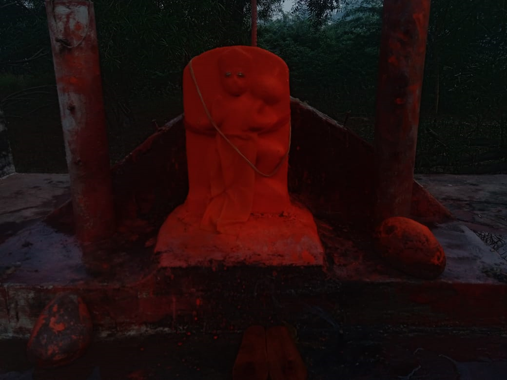

<!DOCTYPE html>
<html lang="hi">
<head>
    <meta charset="UTF-8">
    <meta name="viewport" content="width=device-width, initial-scale=1.0">
</head>
<body>
    <header>
        <h1>खेड़ा पाटे बालाजी धाम में आपका स्वागत है</h1>
        
भगवान हनुमान को समर्पित

    </header>
    <nav>
        <a href="#home">होम</a>
        <a href="#about">हमारे बारे में</a>
        <a href="#events">कार्यक्रम</a>
        <a href="#contact">संपर्क</a>
    </nav>
    <section id="home">
        <h2>होम</h2>
        
खेड़ा पाटे बालाजी धाम उत्तर प्रदेश, भारत में स्थित एक पवित्र हनुमान मंदिर है। दैनिक प्रार्थनाओं और त्योहारों में हमारे साथ जुड़ें।

        
    </section>
    <section id="about">
        <h2>मंदिर के बारे में</h2>
        
[वर्ष, जैसे २०११ ] में स्थापित, यह मंदिर भगवान हनुमान को दैनिक आरती, भजनों और सामुदायिक सेवाओं के साथ सम्मानित करता है। इसमें एक भव्य मूर्ति और शांतिपूर्ण परिवेश है।

    </section>
</section>
    <section id="events">
        <h2>आगामी कार्यक्रम</h2>
        <ul>
            <li>हनुमान जयंती: १५  अप्रैल, २०२६ </li>
            <li>साप्ताहिक आरती: हर मंगलवार और शनिवार</li>
            <li>दान अभियान: मासिक भोजन वितरण</li>
        </ul>
    </section>
    <section id="contact">
        <h2>हमसे संपर्क करें</h2>
        
पता: गाँव बरेस्ट खुर्द , तहसील हड़िय , जिला प्रयागराज , उत्तर प्रदेश - 261204

        
फोन: +91-8756125912 | ईमेल: info@khedapatebalajidham.com

        
अपडेट के लिए हमारे सोशल मीडिया को फॉलो करें।

    </section>
    <footer>
        
&copy; 2024 खेड़ा पाटे बालाजी धाम। सभी अधिकार सुरक्षित।

    </footer>
</body>
</html>
